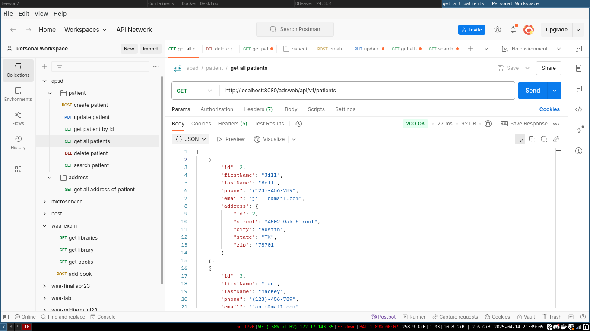
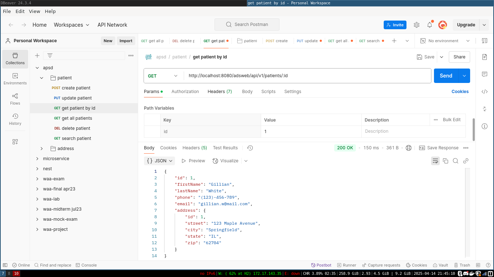
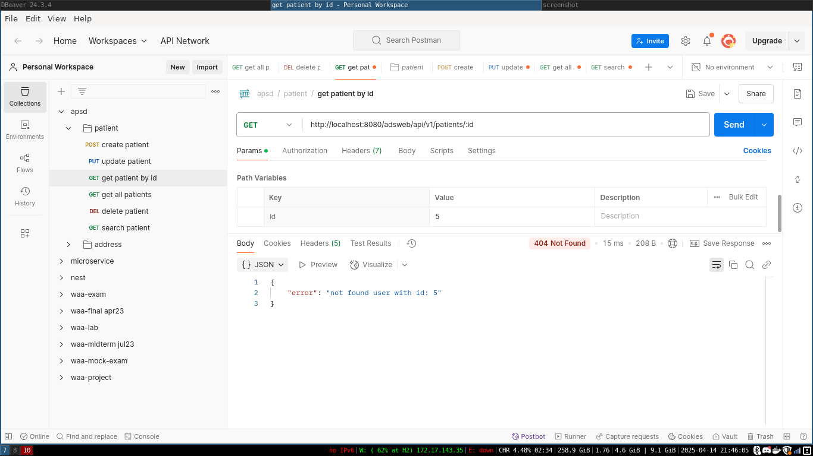
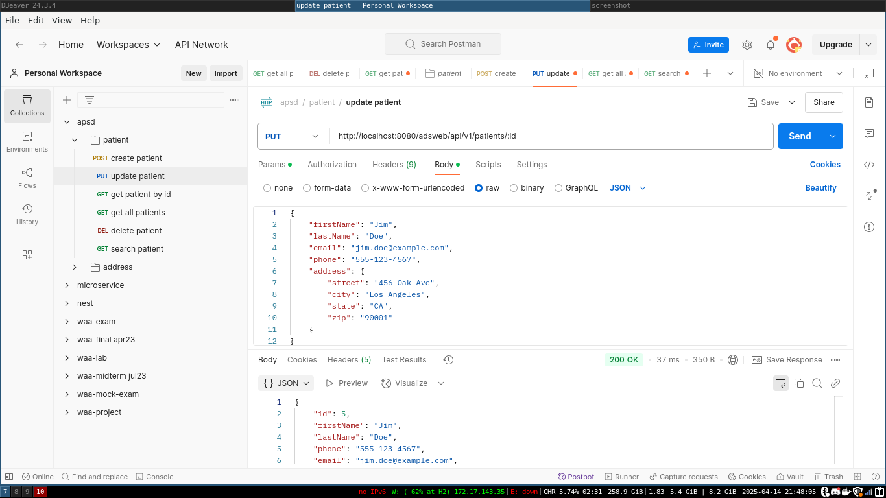
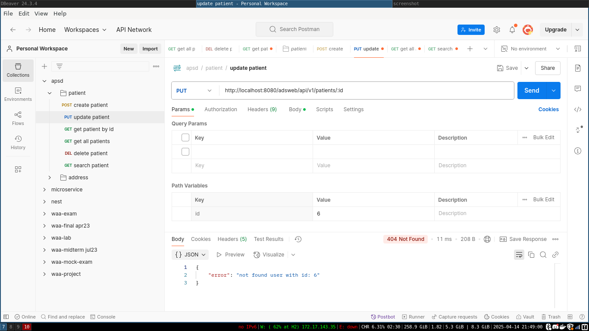
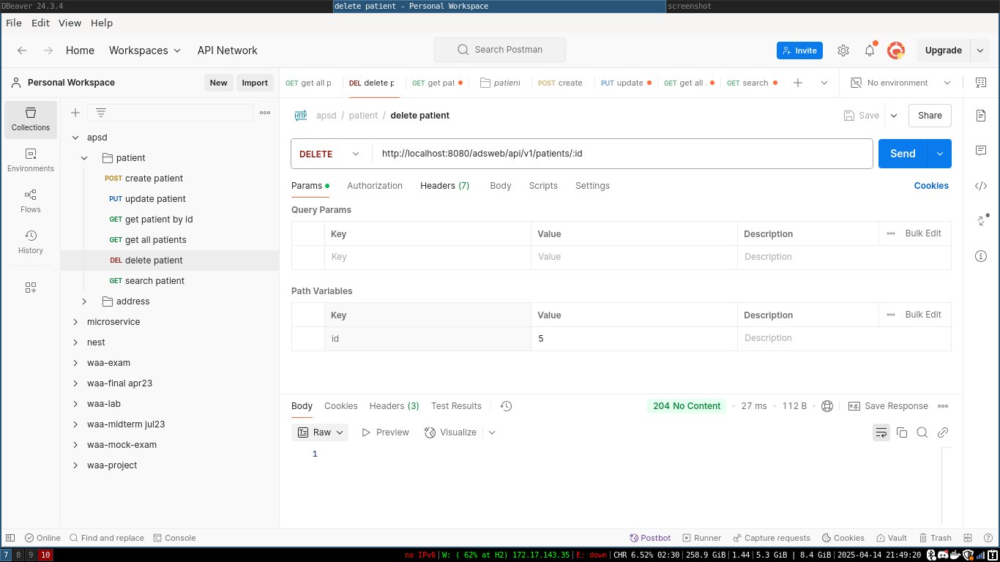
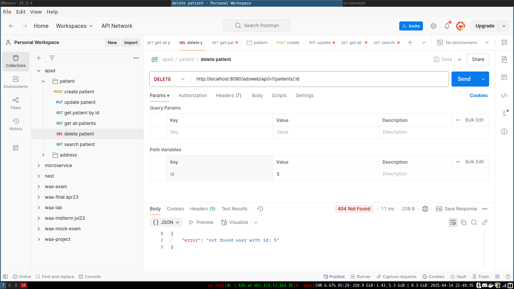
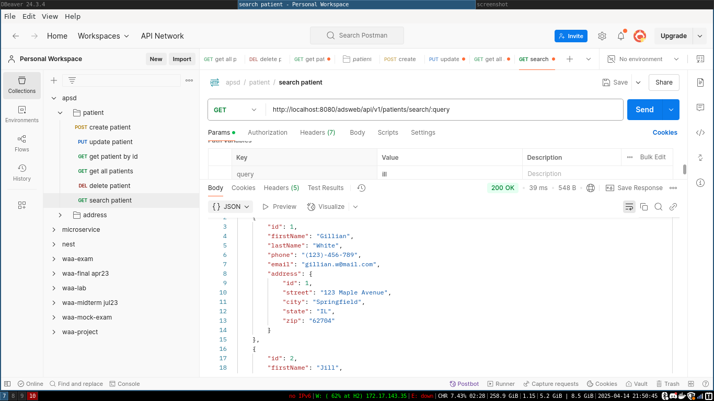
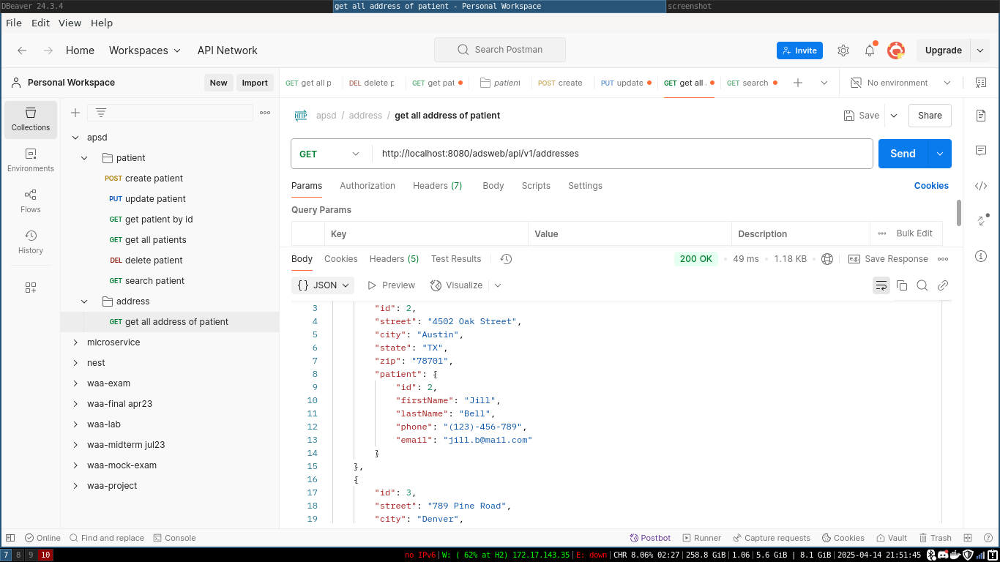

# Lab 7

## Get all patients (sorted by lastName)

## Get patient by id

- success
  

- not found
  

## Create patient

## Update patient

- success
  

- not found
  

## Delete patient

- success
  

- not found
  

## Search patient

## Get addresses (sorted by city)

