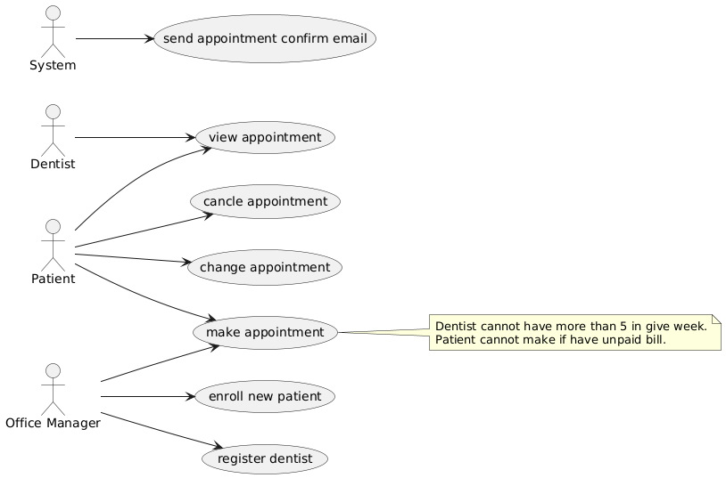

# CS489 final project

## Problem statement

Advantis Dental Surgeries, LLC (ADS) are a company that are in the business of managing a
region. Assume you have been hired by the company, as a Lead Software Engineer and
tasked to lead the effort in designing and developing a web-based software solution (i.e. a
website) which the company will be using to manage their business.

The system will be used by an Office Manager to register Dentists who apply to join their
network of dental surgeries. Each Dentist is given a unique ID number and their First Name,
Last Name, Contact Phone Number, Email and Specialization are recorded into the system.
The Office Manager also uses the system to enroll new Patients who require dental services,
including the Patient’s First Name, Last Name, Contact Phone Number, Email, Mailing
Address and Date of Birth. A Patient can call-in to request appointments to see a dentist. A
Patient can also request appointment by submitting an online form on the ADS website.
Upon receiving a request for an appointment, the Office Manager can then book the
appointment and the system will send a confirmation email notifying the Patient and the
appointment gets recorded accordingly.

Dentists should be able to sign-in to the system and view a listing of all their Appointments,
including details of the Patients who they have been scheduled to see. Each appointment is
normally made for a specific date and time and the dentist is expected to see/treat the
patient at one of ADS’s surgery locations. The system should provide information about
each Surgery, including its name, location address and telephone number. Patients should
be able to sign-in to the system and view their appointments, including the information of
the dentist who they have been booked to see. Patients should also be able to request to
cancel or change their appointments.

A dentist cannot be given more than 5 appointments in any given week. The system should
prevent a Patient from requesting a new appointment if they have an outstanding, unpaid
bill for dental service they have received.

## Usecase diagram



## Class diagram


## ER diagram


## Run application

```bash
./gradlew bootJar
docker compose up -d
```

## REST API docs

- There are 3 user roles `office_manager` `patient` `dentist`
- Open detail to see postman example

---

#### Authentication

<details>

 <summary><code>POST</code> <code><b>/api/v1/login</b></code> <code>(login to get token)</code> </summary>

##### Body

> | name     | type     | data type | description                                 |
> | -------- | -------- | --------- | ------------------------------------------- |
> | username | required | String    | username is email that provided on register |
> | password | required | String    | N/A                                         |

##### Postman


</details>

<details>

 <summary><code>GET</code> <code><b>/api/v1/me</b></code> <code>(get current user profile)</code></summary>

##### Header

> | name          | type     | data type | description                                                           |
> | ------------- | -------- | --------- | --------------------------------------------------------------------- |
> | Authorization | required | String    | Bearer token (the token recived on longin in format "Bearer {token}") |

##### Postman


</details>

---

#### Patient

<details>
 <summary><code>POST</code> <code><b>/api/v1/patients</b></code> <code>(office_manager register patient)</code></summary>

##### Header

> | name          | type     | data type | description                                                           |
> | ------------- | -------- | --------- | --------------------------------------------------------------------- |
> | Authorization | required | String    | Bearer token (the token recived on longin in format "Bearer {token}") |

##### Body

> | name      | type     | data type | description           |
> | --------- | -------- | --------- | --------------------- |
> | firstName | required | String    | N/A                   |
> | lastName  | required | String    | N/A                   |
> | email     | required | String    | N/A                   |
> | password  | required | String    | N/A                   |
> | phone     | required | String    | N/A                   |
> | address   | required | Address   | see address data type |

##### Postman


</details>

---

#### Dentist

<details>
 <summary><code>POST</code> <code><b>/api/v1/dentists</b></code> <code>(office_manager register dentist)</code></summary>

##### Header

> | name          | type     | data type | description                                                           |
> | ------------- | -------- | --------- | --------------------------------------------------------------------- |
> | Authorization | required | String    | Bearer token (the token recived on longin in format "Bearer {token}") |

##### Body

> | name           | type     | data type | description |
> | -------------- | -------- | --------- | ----------- |
> | firstName      | required | String    | N/A         |
> | lastName       | required | String    | N/A         |
> | email          | required | String    | N/A         |
> | password       | required | String    | N/A         |
> | phone          | required | String    | N/A         |
> | specialization | required | String    | N/A         |

##### Postman


</details>

<details>
 <summary><code>GET</code> <code><b>/api/v1/dentists</b></code> <code>(anyone get all dentist)</code></summary>

##### Postman


</details>

---

#### Surgery

<details>
 <summary><code>GET</code> <code><b>/api/v1/surgeries</b></code> <code>(anyone get all surgery)</code></summary>

##### Postman


</details>

---

#### Appointment

<details>
 <summary><code>POST</code> <code><b>/api/v1/appointments</b></code> <code>(office_manager make appointment for patient)</code></summary>

##### Header

> | name          | type     | data type | description                                                           |
> | ------------- | -------- | --------- | --------------------------------------------------------------------- |
> | Authorization | required | String    | Bearer token (the token recived on longin in format "Bearer {token}") |

##### Body

> | name      | type     | data type | description |
> | --------- | -------- | --------- | ----------- |
> | date      | required | String    | yyy-MM-dd   |
> | time      | required | String    | hh:mm       |
> | dentistId | required | Number    | N/A         |
> | patientId | required | Number    | N/A         |
> | surgeryId | required | Number    | N/A         |

##### Postman


</details>

<details>
 <summary><code>POST</code> <code><b>/api/v1/appointments/patient</b></code> <code>(patient make appointment for himself)</code></summary>

##### Header

> | name          | type     | data type | description                                                           |
> | ------------- | -------- | --------- | --------------------------------------------------------------------- |
> | Authorization | required | String    | Bearer token (the token recived on longin in format "Bearer {token}") |

##### Body

> | name      | type     | data type | description |
> | --------- | -------- | --------- | ----------- |
> | date      | required | String    | yyy-MM-dd   |
> | time      | required | String    | hh:mm       |
> | dentistId | required | Number    | N/A         |
> | surgeryId | required | Number    | N/A         |

##### Postman


</details>

<details>
 <summary><code>PUT</code> <code><b>/api/v1/appointments/:id</b></code> <code>(patient reschedule appointment for himself)</code></summary>

##### Header

> | name          | type     | data type | description                                                           |
> | ------------- | -------- | --------- | --------------------------------------------------------------------- |
> | Authorization | required | String    | Bearer token (the token recived on longin in format "Bearer {token}") |

##### Body

> | name      | type     | data type | description |
> | --------- | -------- | --------- | ----------- |
> | date      | required | String    | yyy-MM-dd   |
> | time      | required | String    | hh:mm       |
> | dentistId | required | Number    | N/A         |
> | surgeryId | required | Number    | N/A         |

##### Postman


</details>

<details>
 <summary><code>POST</code> <code><b>/api/v1/appointments/:id/cancel</b></code> <code>(patient cancel appointment for himself)</code></summary>

##### Postman


</details>

<details>
 <summary><code>GET</code> <code><b>/api/v1/appointments</b></code> <code>(office_manager see all appointment, patient see only his appointment, dentist see only his appointment)</code></summary>

##### Query params

> | name          | type     | data type | description      |
> | ------------- | -------- | --------- | ---------------- |
> | page          | optional | Number    | N/A              |
> | pageSize      | optional | Number    | N/A              |
> | sortBy        | optional | String    | N/A              |
> | sortDirection | optional | String    | oneOf(asd, desc) |

##### Header

> | name          | type     | data type | description                                                           |
> | ------------- | -------- | --------- | --------------------------------------------------------------------- |
> | Authorization | required | String    | Bearer token (the token recived on longin in format "Bearer {token}") |

##### Postman


</details>
